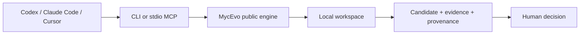

# MycEvo

**A local external workflow brain for people who work across Codex, Claude Code, Cursor, and other Agents.**

[简体中文](README.zh-CN.md)

> Release status: **PaperFrames v0.2.0-rc.1**. This Source-Available Technical Preview release candidate is distributed under Apache-2.0. See [Licensing](#licensing).

Agents can finish a task and still lose the method behind it: why a decision was made, which evidence mattered, what failed, which constraints are non-negotiable, and what the next Agent must verify. MycEvo turns those task outcomes into a local, reviewable workflow memory.

It is not another chat UI or Agent runtime. It sits above execution tools and manages:

- candidate workflow improvements;
- evidence, diffs, decisions, and provenance;
- human-controlled promotion;
- reusable handoff context across Agents;
- local workspace state that remains inspectable and portable.

## Why MycEvo

```text
Agent A executes work
  -> captures evidence and a proposed method change
  -> MycEvo stores a candidate
  -> a human reviews the evidence
  -> a future Agent recalls the accepted context
```

MycEvo is intentionally model-agnostic. It does not bundle an LLM and the deterministic demo does not require another model API key.

## What ships in this Technical Preview

| Capability | Entry point | Status |
|---|---|---|
| Portable local workspace | `mycevo init` | Shipped and tested |
| Deterministic candidate-first loop | `mycevo demo` | Shipped and tested |
| Installation/workspace diagnostics | `mycevo doctor`, `mycevo status` | Shipped and tested |
| Workspace registration | `mycevo workspace` | Shipped and tested |
| Recall, intake, closeout, evaluation | legacy source-checkout services | Compatibility only; not part of the wheel contract |
| Append-only provenance | `mycevo provenance` | Shipped and tested |
| Codex and Claude Code MCP configuration | `mycevo mcp install ... --dry-run` | Shipped and tested as dry-run configuration |
| Human decision and canonical promotion | — | Not yet a standalone public contract |
| Complete handoff, rollback, import, export, delete lifecycle | — | Roadmap; not claimed as shipped |
| Team collaboration, RBAC, sync, shared canonical state | — | Future Team product; not in this repository |

The normative status table is [the release contract](docs/release/community-release-contract.md). MycEvo will use the **Community** label only after every required single-user lifecycle row is shipped and tested.

## Five-minute local demo

Requirements: Python 3.10 or newer.

```powershell
python -m pip install -e .

$workspace = Join-Path $env:TEMP "mycevo-demo"
$env:MYCEVO_USER_ROOT = Join-Path $env:TEMP "mycevo-demo-user"
mycevo --root $workspace init --json
mycevo --root $workspace demo --json
mycevo --root $workspace doctor --json
```

The demo writes a `pending validation` candidate and explicitly reports `promotion_performed: false`.

Try the Agent configuration dry-runs:

```powershell
mycevo --root $workspace mcp install codex --dry-run
mycevo --root $workspace mcp install claude --dry-run
```

See [the complete demo](docs/getting-started/five-minute-demo.md) and [cross-Agent example](examples/cross-agent-handoff/README.md).

## Product boundary

The public single-user product owns local workflow capture, candidates, evidence, provenance, human authority, portable formats, CLI/MCP surfaces, public packs, and security fixes.

Future paid Team value starts where collaboration complexity starts: members, roles, shared canonical state, review queues, multi-person approvals, synchronization, conflict handling, team audit, and administration.

MycEvo does not plan to paywall user-data export/deletion, single-user provenance, human promotion authority, security fixes, or compatibility with published formats. See [Community and Team boundary](docs/product/community-team-boundary.md).

## Architecture

MycEvo is local-first and Agent-agnostic:



A private ResearchLoop instance may depend on a version-locked MycEvo engine. The public engine must never import private registries, prompts, run data, or absolute local paths. See [target architecture](docs/architecture/target-architecture.md).

## Relationship to other tools

- Agent runtimes execute tasks; MycEvo preserves and governs reusable methods.
- Dify, n8n, and Flowise compose applications or automations; MycEvo records why a workflow should change and whether evidence supports that change.
- Langfuse and LangSmith trace model/application runs; MycEvo also governs non-LLM artifacts, decisions, workflow candidates, and cross-Agent handoff.
- ResearchLoop is the research-oriented origin and compatibility pack, not the public product name.

## Capture levels

- **L0 portable:** file and command protocol usable by any Agent.
- **L1 verified adapter:** tested configuration or MCP integration.
- **L2 native capture:** richer tool-specific event capture; roadmap unless explicitly proven.

Documentation must not describe an L0/L1 path as full native capture.

## Development

```powershell
python -m pip install -e .
$env:PYTEST_DISABLE_PLUGIN_AUTOLOAD='1'
python -m pytest -q
```

The current verified local baseline is 50 passing tests on Windows. GitHub Actions defines Windows/Ubuntu, Python 3.10–3.12, editable/wheel coverage.

## Licensing

The intended model is **source-available**, not OSI open source.

MycEvo is licensed under [Apache-2.0](LICENSE). Third-party dependencies and assets retain their original licenses; see [NOTICE](NOTICE) and [third-party notices](THIRD_PARTY_NOTICES.md).

No pricing is defined in this repository. See:

- [Licensing FAQ](LICENSING_FAQ.md)
- [Commercial licensing guide](COMMERCIAL-LICENSE.md)
- [License provenance and approval gate](docs/release/license-provenance.md)

## Contributing

Issues, design feedback, reproducibility reports, adapter proposals, and non-substantive documentation corrections are welcome during the preview. Substantive code contributions remain blocked until the contributor-license process is approved. See [CONTRIBUTING.md](CONTRIBUTING.md).

## Security and privacy

Do not submit private prompts, task traces, credentials, unpublished research, raw data, databases, or absolute user paths. See [SECURITY.md](SECURITY.md) and the [public file manifest](docs/release/public-file-manifest.yaml).
