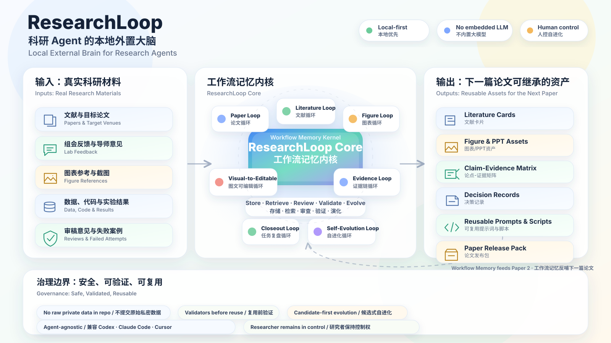
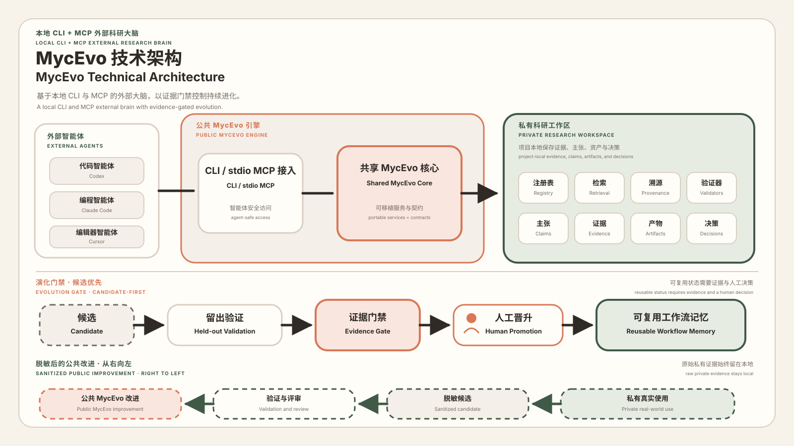
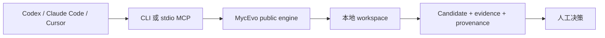

# MycEvo





**为跨 Codex、Claude Code、Cursor 等 Agent 工作的人提供本地“外置工作流大脑”。**

[English](README.md)

> 发布状态：**PaperFrames v0.2.0-rc.1**。本候选版本采用 Apache-2.0；第三方依赖和素材仍适用其原始许可证。

Agent 可以完成一次任务，却很容易丢失任务背后的方法：为什么这样决策、哪些证据有效、什么尝试失败、哪些约束不能破坏、下一个 Agent 必须复核什么。MycEvo 把这些结果沉淀为本地、可复查、可演进的工作流记忆。

它不是新的聊天界面，也不是 Agent 执行器。它位于 Codex、Claude Code、Cursor 等执行工具之上，负责管理：

- 工作流改进候选；
- 证据、diff、决策和 provenance；
- 人工控制的晋升；
- 跨 Agent 可复用的交接上下文；
- 可检查、可迁移的本地 workspace 状态。

## 为什么需要 MycEvo

```text
Agent A 执行任务
  -> 记录证据和方法改进建议
  -> MycEvo 写入 candidate
  -> 人类审查证据
  -> 后续 Agent 继承已接受的上下文
```

MycEvo 不绑定模型，不内置 LLM；确定性 demo 不要求额外模型 API key。

## 当前 Technical Preview 实际提供什么

| 能力 | 入口 | 状态 |
|---|---|---|
| 可移植本地 workspace | `mycevo init` | 已实现并测试 |
| 确定性 candidate-first loop | `mycevo demo` | 已实现并测试 |
| 安装与 workspace 诊断 | `mycevo doctor`、`mycevo status` | 已实现并测试 |
| workspace 登记 | `mycevo workspace` | 已实现并测试 |
| recall、intake、closeout、evaluation | 旧版 source-checkout 服务 | 仅兼容，不属于 wheel 正式契约 |
| append-only provenance | `mycevo provenance` | 已实现并测试 |
| Codex / Claude Code MCP 配置 | `mycevo mcp install ... --dry-run` | 已实现 dry-run 并测试 |
| 独立的人工决策与 canonical 晋升契约 | — | 尚未作为公开接口完成 |
| 完整 handoff、rollback、import、export、delete 生命周期 | — | roadmap，不宣称已完成 |
| 团队协作、RBAC、同步、共享 canonical | — | 未来 Team 产品，不在当前仓库 |

规范状态以[发布契约矩阵](docs/release/community-release-contract.md)为准。只有单用户核心循环每一项都达到 `shipped + tested`，MycEvo 才使用 **Community** 名称。

## 五分钟本地 Demo

需要 Python 3.10 或更高版本。

```powershell
python -m pip install -e .

$workspace = Join-Path $env:TEMP "mycevo-demo"
$env:MYCEVO_USER_ROOT = Join-Path $env:TEMP "mycevo-demo-user"
mycevo --root $workspace init --json
mycevo --root $workspace demo --json
mycevo --root $workspace doctor --json
```

Demo 会写入一个 `pending validation` candidate，并明确返回 `promotion_performed: false`。

测试 Agent 配置 dry-run：

```powershell
mycevo --root $workspace mcp install codex --dry-run
mycevo --root $workspace mcp install claude --dry-run
```

继续阅读[完整 Demo](docs/getting-started/five-minute-demo.md)和[跨 Agent 示例](examples/cross-agent-handoff/README.md)。

## Community 与未来收费边界

公开单用户产品负责本地工作流捕获、candidate、证据、provenance、人工权限、可移植格式、CLI/MCP、公共 pack 和安全修复。

未来 Team 的付费价值从多人协作复杂度开始：成员、角色、共享 canonical、review queue、多人审批、同步、冲突处理、团队审计和管理后台。

MycEvo 不计划把用户数据导出/删除、单用户 provenance、人工晋升权、安全修复和公开格式兼容做成强制付费墙。详见 [Community / Team 边界](docs/product/community-team-boundary.md)。

## 架构边界



私有 ResearchLoop instance 可以依赖固定版本的 MycEvo public engine；public engine 不能反向导入私有 registry、prompt、run 数据或绝对本地路径。详见[目标架构](docs/architecture/target-architecture.md)。

## 与相邻工具的区别

- Agent runtime 负责执行；MycEvo 负责方法的沉淀、审核和演进。
- Dify、n8n、Flowise 负责应用或自动化编排；MycEvo 记录为什么要改工作流、证据是否支持修改。
- Langfuse、LangSmith 偏向模型与应用 trace；MycEvo 还治理非 LLM 资产、决策、候选和跨 Agent 交接。
- ResearchLoop 是科研方向的起源与兼容 pack，不再是公共产品名。

## 捕获完整度

- **L0 portable：**任何 Agent 都能使用的文件和命令协议。
- **L1 verified adapter：**通过测试的配置或 MCP 集成。
- **L2 native capture：**工具原生事件捕获；没有明确证据时只属于 roadmap。

不能把 L0/L1 文档路径宣传成完整原生捕获。

## 开发与验证

```powershell
python -m pip install -e .
$env:PYTEST_DISABLE_PLUGIN_AUTOLOAD='1'
python -m pytest -q
```

当前 Windows 本地验证基线为 50 项测试通过。GitHub Actions 已定义 Windows/Ubuntu、Python 3.10–3.12、editable/wheel 矩阵。

## 许可证

预期模式是 **source-available（源码可见）**，不是 OSI open source。

MycEvo 使用 [Apache-2.0](LICENSE) 许可证。第三方依赖和素材仍适用其原始许可证，详见 [NOTICE](NOTICE) 和 [第三方声明](THIRD_PARTY_NOTICES.md)。

当前不讨论具体价格。参见：

- [许可证 FAQ](LICENSING_FAQ.md)
- [商业授权说明](COMMERCIAL-LICENSE.md)
- [许可证来源与审批门禁](docs/release/license-provenance.md)

## 贡献

Technical Preview 阶段欢迎 Issue、设计反馈、复现报告、adapter proposal 和非实质文档修正。贡献者授权流程批准前，不合并实质代码 PR。详见 [CONTRIBUTING.md](CONTRIBUTING.md)。

## 安全与隐私

不要提交私有 prompt、任务 trace、凭据、未公开研究、原始数据、数据库或用户绝对路径。参见 [SECURITY.md](SECURITY.md) 和[公开文件清单](docs/release/public-file-manifest.yaml)。
