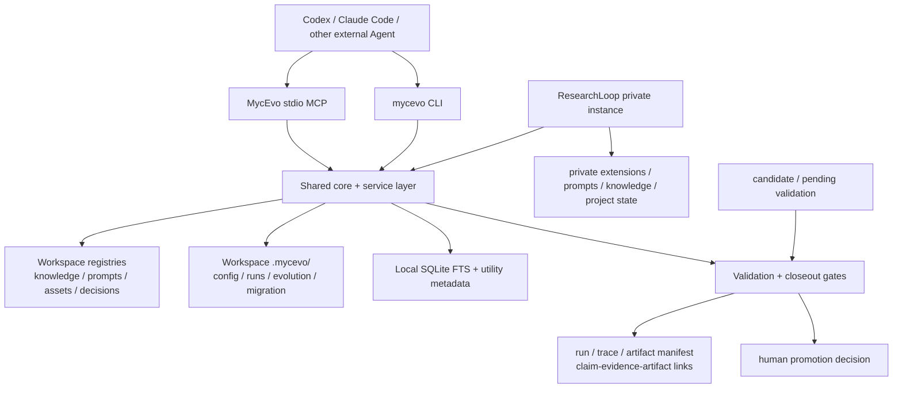

# MycEvo Target Architecture



The public engine owns portable behavior, schemas, validators, CLI services,
MCP adapters, and sanitized examples. The private instance owns workspace
configuration, personal registries, knowledge, prompts, decisions, project
state, run records, and immature extensions. Compatibility wrappers remain at
the private boundary until each duplicated module has a replacement and a
passing regression test.

The dependency direction is one-way:

```text
ResearchLoop private instance -> version-locked MycEvo public engine
sanitized private experience -> candidate -> validation -> explicit contribution to MycEvo
```

The private workspace should record the exact MycEvo package or Git commit it
uses in `researchloop.lock.yaml` (or an equivalent package lock). Updating the
engine is an explicit compatibility decision; MycEvo must not discover,
import, or read ResearchLoop private state as part of normal operation.

The arrows above describe dependency and contribution separately. The public
engine never imports a private registry, prompt, decision, run, project state,
or absolute local path. A private instance may consume a versioned public
engine; only a deliberately sanitized and reviewed contribution may flow back.

No promotion path may infer `validated`, `reusable`, `approved`, `pass`, or
`paper_ready` from an ordinary MCP call or an automatic writeback.
